#Servidor LDAP - OpenSUSE

##1.1 Preparar la máquina
Comenzamos la instalación del servidor LDAP:
* Vamos a usar una MV para montar nuestro servidor LDAP con:
    * SO OpenSUSE 13.2
    * Instalar servidor SSH.
    * IP estática del servidor 172.18.11.51
    * Nombre equipo: `ldap-serverXX`
    * Dominio: `curso1516`
    * Además en `/etc/hosts` añadiremos:
```
127.0.0.2   ldap-server11.curso1516   ldap-server11
127.0.0.3   kilian11.curso1516  kilian11
```
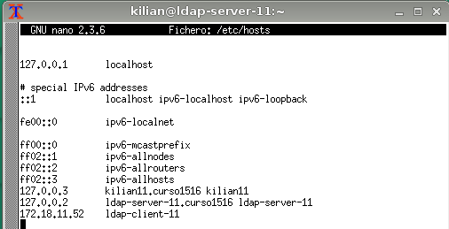
* Capturar imagen de la salida de los siguientes comandos: `ip a`, `hostname -f`, `lsblk`, `blkid`


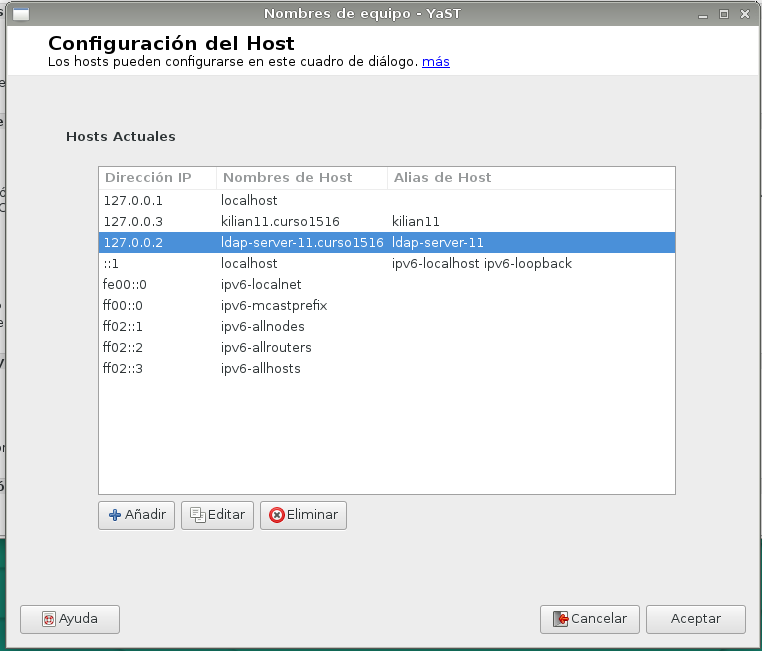

##1.2 Instalación del Servidor LDAP
* Procedemos a la instalación del módulo Yast para gestionar el servidor LDAP (`yast2-auth-server`).
En Yast aparecerá como `Authentication Server`.
* Apartir de aquí seguimos los pasos indicados en [servidor LDAP](https://es.opensuse.org/Configurar_LDAP_usando_YaST)
de la siguiente forma:
   * Ir a Yast -> Servidor de autenticación.
   * Tipo de servidor: autónomo
   * Configuración TLS: NO habilitar
   * Usar como DN el siguiente: `dc=kilian11, dc=curso1516`. 
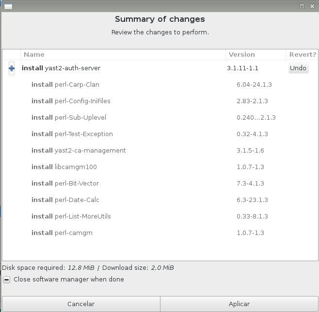
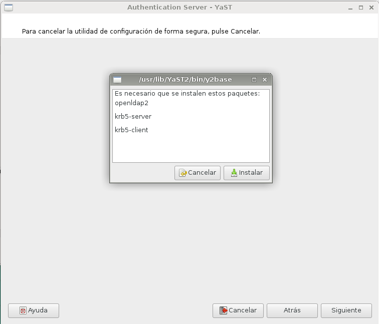
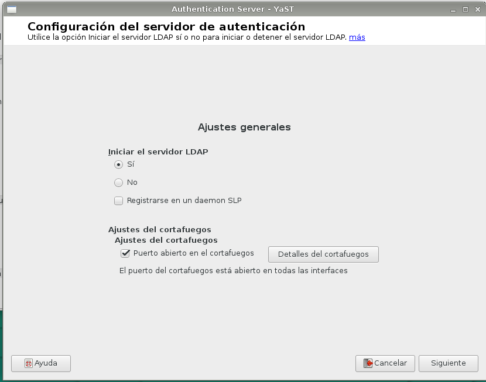
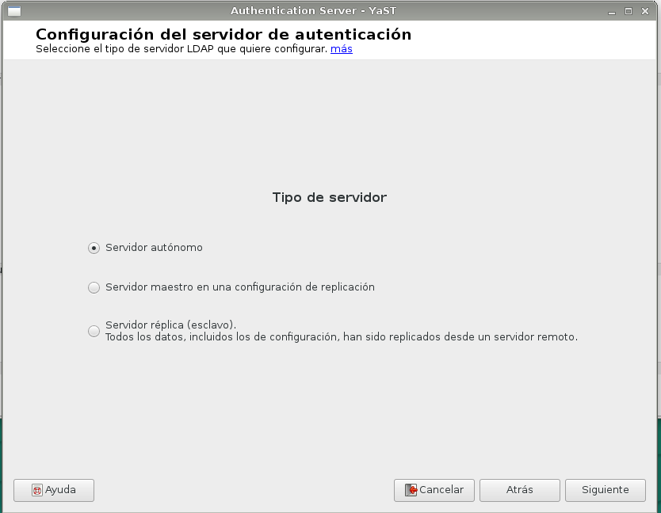
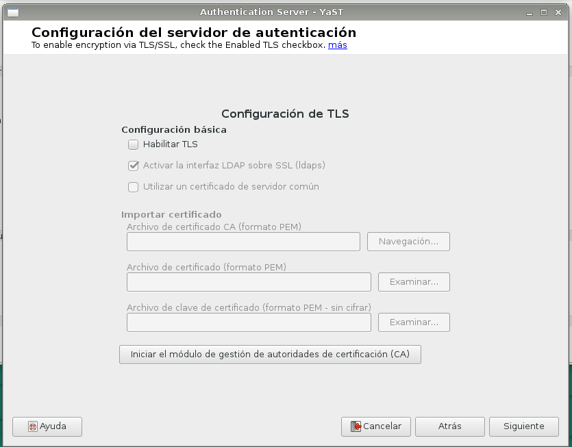
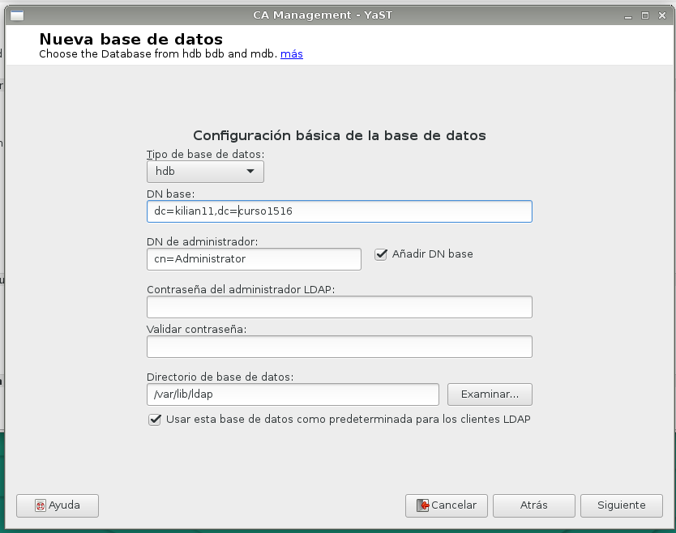


   * NO habilitar kerberos.
   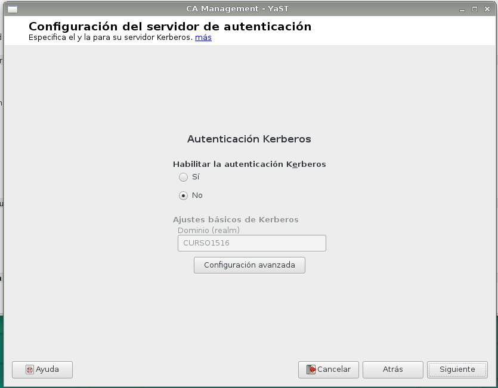
   
Veamos ejemplo de la configuración final:

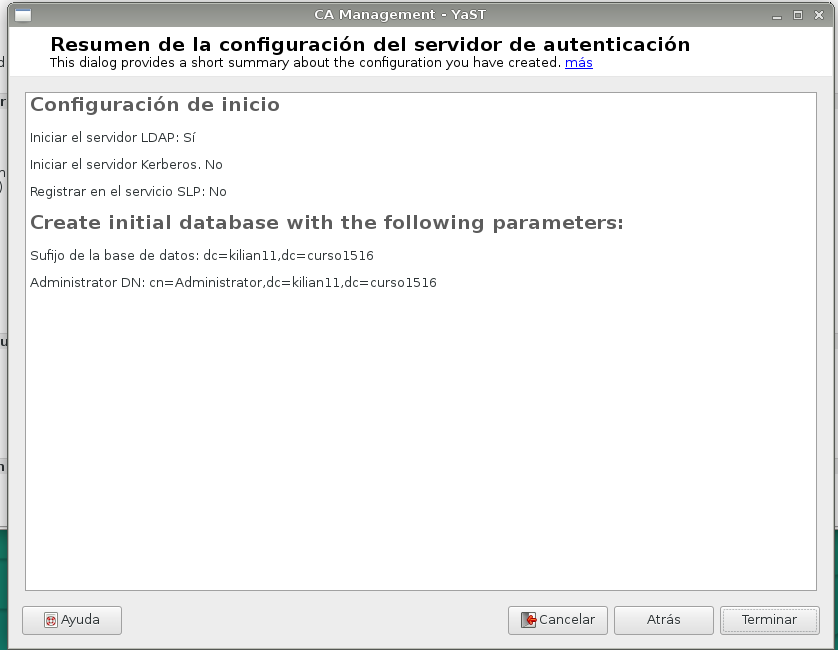

* Una vez instalado, comprobar el servicio `systemctl  status slapd`. 
Comprobar también que el servicio se inicia automáticamente al reiniciar la máquina. 

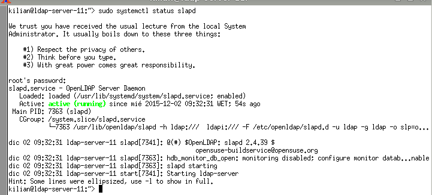
* Continuar los pasos del enlace hasta el final, donde se puede comprobar el contenido
de la base de datos LDAP usando la herramienta `gq`. Esta herramienta es un browser LDAP.
* Comprobar que ya tenemos las unidades organizativas: `groups` y `people`.

##1.3. Crear usuarios y grupos en LDAP
Ahora vamos a [introducir datos de usuarios y grupos](https://es.opensuse.org/Ingreso_de_usuarios_y_grupos_en_LDAP_usando_YaST)
en el servidor LDAP siguiendo los pasos indicados en el enlace, pero personalizado la información de la siguiente
forma:

* Debemos instalar el paquete `yast2-auth-client`, que nos ayudará a configurar la máquina para autenticación.
En Yast aparecerá como `Authentication Client`.
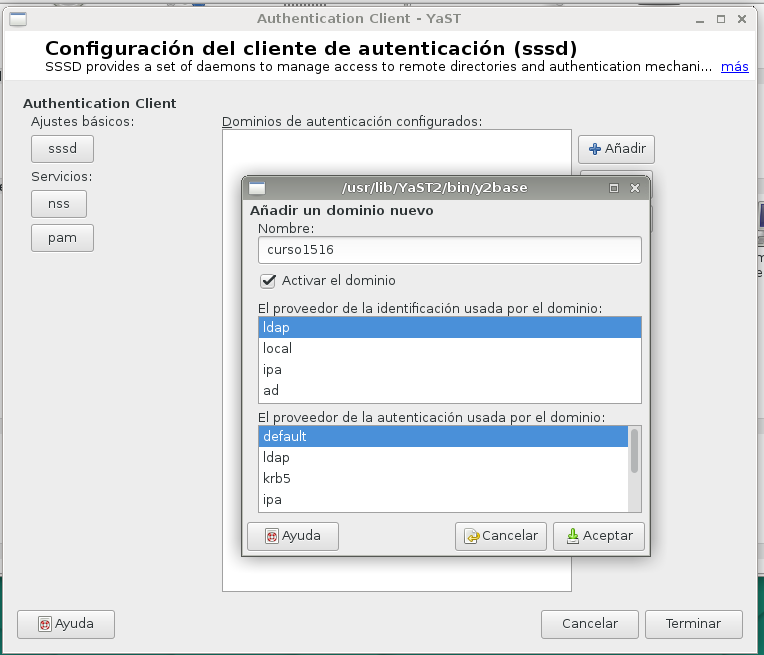


> * El parámetro LDAP URI es un localizador del recurso de la base de datos LDAP. 
Veamos un ejemplo: `ldap://ldap-server11/dc=kilian11,dc=curso1516`.
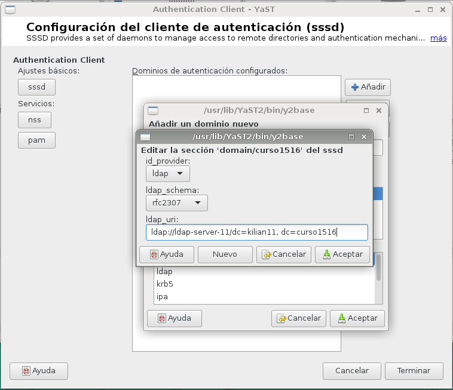
> * Las unidades organizativas: `groups` y `people`. Han sido creadas 
automáticamente por Yast en el paso anterior.

* Crear los grupos `jedis2` y `siths2` (Estos se crearán dentro de la `ou=groups`).
* Crear los usuarios `jedi21`, `jedi22`, `sith21`, `sith22` (Estos se crearán dentro de la `ou=people`).
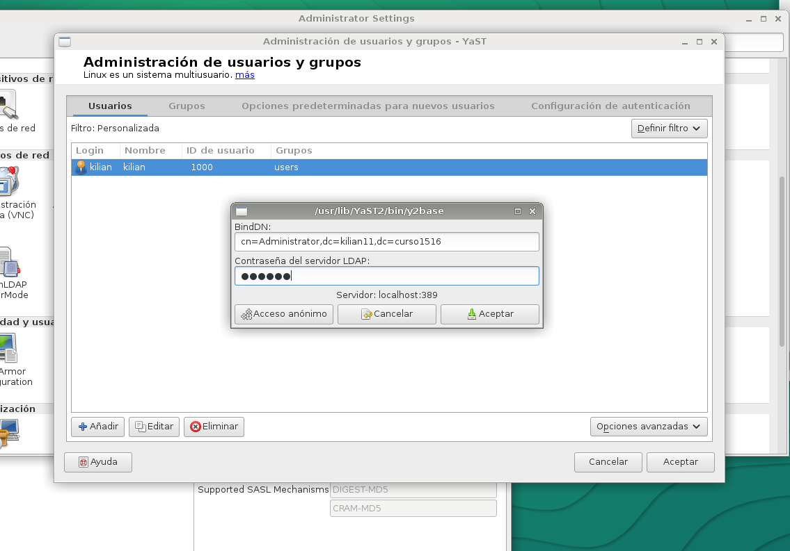
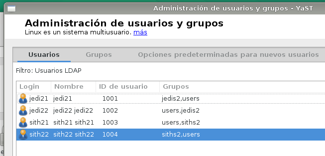
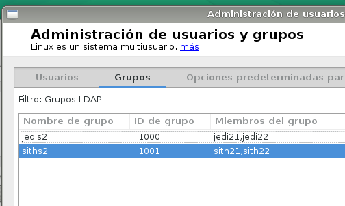
Vemos un ejemplo de un árbol de datos en LDAP:


* Comprobar mediante un browser LDAP (`gq`) la información que tenemos en la base de datos LDAP.
 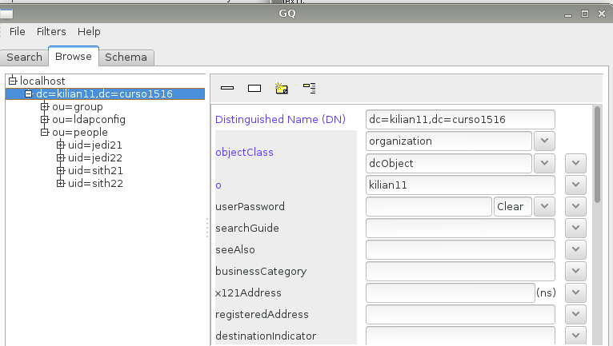

* Logearnos como uno de los usuarios LDAP siendo ya root.
 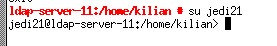