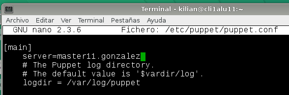
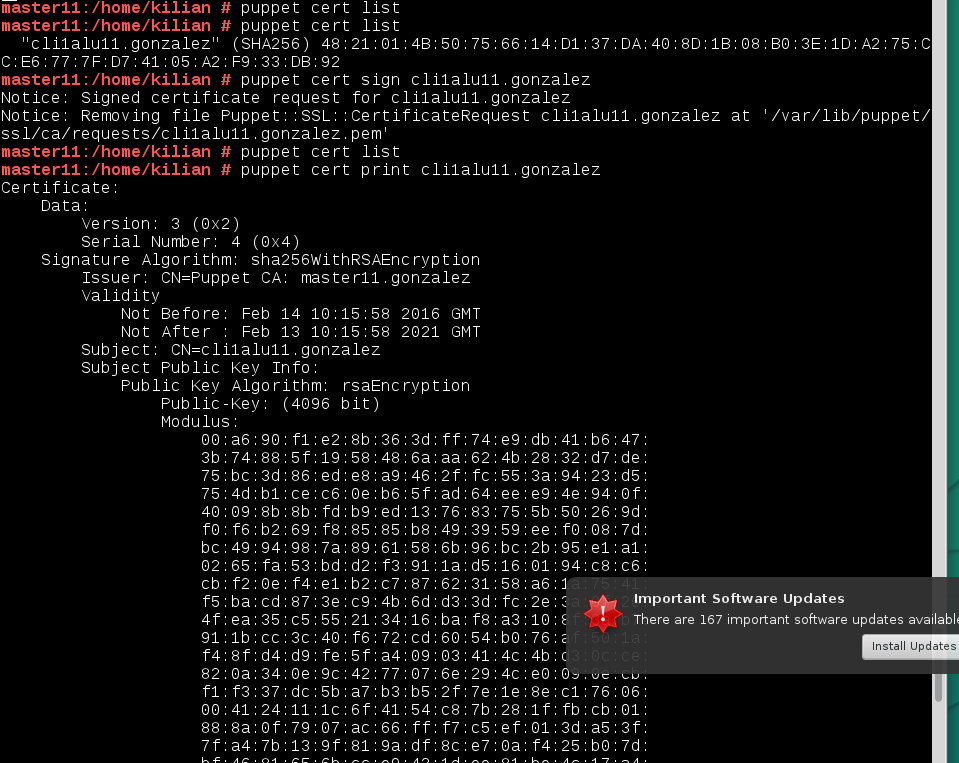
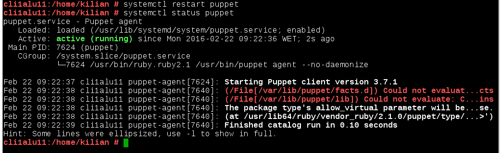
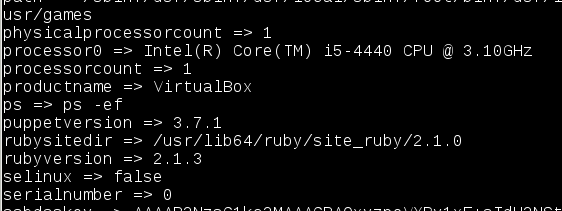
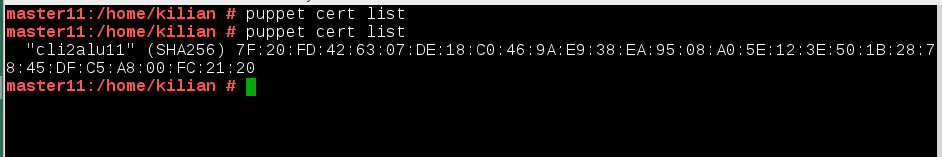
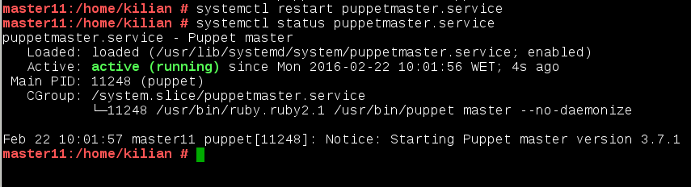

#1.1 Configuración

> En OpenSUSE podemos hacer configurar el equipo a través de `Yast`


Vamos a usar 3 MV's con las siguientes configuraciones:
* MV1 - master: Dará las órdenes de instalación/configuración a los clientes.
    * SO GNU/Linux OpenSUSE 13.2
    * IP estática 172.18.11.100
    * Enlace: 172.18.0.1
    * DNS: 8.8.4.4
    * Nombre del equipo: master11
    * Dominio = gonzalez
    * Instalar OpenSSH-Server para acceso del profesor.
* MV1 - client1: recibe órdenes del master.
    * SO GNU/Linux OpenSUSE 13.2
    * IP estática 172.18.11.101
    * Enlace: 172.18.0.1
    * DNS: 8.8.4.4
    * Nombre del equipo: cli1alu11
    * Dominio = gonzalez
    * Instalar OpenSSH-Server para acceso del profesor.
* MV3 - client2: recibe órdenes del master.
    * SO Windows 7. Este SO debe haber sido instalado por cada alumno. 
    NO clonar de un compañero y/o profesor.
    * IP estática 172.18.11.102
    * Enlace: 172.18.0.1
    * DNS: 8.8.4.4
    * Nombre Netbios: cli2alu11
    * Nombre del equipo: cli2alu11
    * Grupo de trabajo = AULA108
    * Instalar ServidorSSH para acceso del profesor.


##1.2 Comprobacion de las configuraciones

En GNU/Linux, para comprobar que las configuraciones son correctas hacemos:

```
    date
    ip a
    route -n
    host www.google.es
    hostname -a
    hostname -f
    hostname -d
    ping master11
    ping master11.gonzalez
    ping cli1alu11
    ping cli1alu11.gonzalez
    ping cli2alu11
    ping cli2alu11.gonzalez   
```
*Master
> 
> 
*Cli1
> 
> 

En Windows comprobamos con:

```
    date
    ipconfig
    route /PRINT
    nslookup www.google.es
    ping master11
    ping master11.gonzalez
    ping cli1alu11
    ping cli1alu11.gonzalez
    ping cli2alu11
    ping cli2alu11.gonzalez  
```
> 
> 

#2. Primera versión del fichero pp

* Instalamos Puppet Master en la MV master11: `zypper install puppet-server puppet puppet-vim`.
> 
* `systemctl status puppetmaster`: Consultar el estado del servicio.
* `systemctl enable puppetmaster`: Permitir que el servicio se inicie automáticamente en el inicio de la máquina.
* `systemctl start puppetmaster`: Iniciar el servicio. En este momento debería haberse creado el
directorio `/etc/puppet/manifests`.
* `systemctl status puppetmaster`: Consultar el estado del servicio.
* Preparamos los ficheros/directorios en el master:
```
    mkdir /etc/puppet/files
    mkdir /etc/puppet/manifests
    mkdir /etc/puppet/manifests/classes
    touch /etc/puppet/files/readme.txt
    touch /etc/puppet/manifests/site.pp
    touch /etc/puppet/manifests/classes/hostlinux1.pp
```
> 

##2.1 /etc/puppet/files/readme.txt

* Contenido para readme.txt: `"¡Que la fuerza te acompañe!"`.
> 
> Los ficheros que se guardan en `/etc/puppet/files` se pueden 
descargar por el resto de máquinas puppet.
>
> Ejemplo de configuración puppet para descargar fichero:
> ```
> file {  '/opt/readme.txt' :
>         source => 'puppet:///files/readme.txt', 
> }
> ```

##2.2 /etc/puppet/manifests/site.pp

* `/etc/puppet/manifests/site.pp` es el fichero principal de configuración 
de órdenes para los agentes/nodos puppet.
* Contenido de nuestro `site.pp`:
```
import "classes/*"

node default {
  include hostlinux1
}
```
> 
> Esta configuración significa:
> * Todos los ficheros de configuración del directorio classes se añadirán a este fichero.
> * Todos los nodos/clientes van a usar la configuración `hostlinux1`
````

##2.3 /etc/puppet/manifests/classes/hostlinux1.pp

Como podemos tener muchas configuraciones, vamos a separarlas en distintos ficheros para
organizarnos mejor, y las vamos a guardar en la ruta `/etc/puppet/manifests/classes`

*Vamos a crear una primera configuración para máquina estándar GNU/Linux.
* Contenido para `/etc/puppet/manifiests/classes/hostlinux1.pp`:
```
class hostlinux1 {
  package { "tree": ensure => installed }
  package { "traceroute": ensure => installed }
  package { "geany": ensure => installed }
}
```
> 

> **OJO**: La ruta del fichero es `/etc/puppet/manifests/classes/hostlinux1.pp`.

* Comprobar que tenemos los permisos adecuados en la ruta `/var/lib/puppet`.
> 
* Reiniciamos el servicio `systemctl restart puppetmaster`.
* Comprobamos que el servicio está en ejecución de forma correcta.
    * `systemctl status puppetmaster`
    * `netstat -ntap`
> 
> 
* Consultamos log por si hay errores: `tail /var/log/puppet/*.log`
> 
* Abrir el cortafuegos para el servicio.
> 


#3. Instalación y configuración del cliente1

Instalación:
* Instalamos Agente Puppet en el cliente: `zypper install puppet`
> 
* El cliente puppet debe ser informado de quien será su master. 
Para ello, añadimos a `/etc/puppet/puppet.conf`:

```
    [main]
    server=master11.gonzalez
    ...
```
> 
* Comprobar que tenemos los permisos adecuados en la ruta `/var/lib/puppet`.
* > 
* `systemctl status puppet`: Ver el estado del servicio puppet.
* `systemctl enable puppet`: Activar el servicio en cada reinicio de la máquina.
* `systemctl start puppet`: Iniciar el servicio puppet.
* `systemctl status puppet`: Ver el estado del servicio puppet.
* `netstat -ntap`: Muestra los servicios conectados a cada puerto.
* > 
* Comprobamos los log del cliente: `tail /var/log/puppet/puppet.log`
* > 


#4. Certificados

Antes de que el master acepte a cliente1 como cliente, se deben intercambiar los certificados entre 
ambas máquinas. Esto sólo hay que hacerlo una vez.

##4.1 Aceptar certificado

* Vamos al master y consultamos las peticiones pendiente de unión al master: `puppet cert list`
```
    root@master11# puppet cert list
    "cli1alu11.gonzalez" (D8:EC:E4:A2:10:55:00:32:11:F2:88:9D:94:E5:41:D6)
    root@master11#
```
* > 
> **En caso de no aparecer el certificado en espera*
>
> * Si no aparece el certificado del cliente en la lista de espera del servidor, quizás
el cortafuegos del servidor y/o cliente, está impidiendo el acceso.
> * Volver a reiniciar el servicio en el cliente y comprobar su estado.

* Aceptar al nuevo cliente desde el master `puppet cert sign "nombre-máquina-cliente"`
```
    root@master11# puppet cert sign "cli1alu11.gonzalez"
    notice: Signed certificate request for cli1alu11.gonzalez
    notice: Removing file Puppet::SSL::CertificateRequest cli1alu11.gonzalez at '/var/lib/puppet/ssl/ca/requests/cli1alu11.gonzalez.pem'

    root@master11# puppet cert list

    root@master11# puppet cert print cli1alu11.gonzalez
    Certificate:
    Data:
    ....
```
* > 
A continuación podemos ver una imagen de ejemplo, los datos no tienen que coincidir con
lo que se pide en el ejercicio.


##4.2 Comprobación final

* Vamos a cliente1 y reiniciamos la máquina y/o el servicio Puppet.
* * > 
* Comprobar que los cambios configurados en Puppet se han realizado.
* En caso contrario, ejecutar comando para comprobar errores: 
    * `puppet agent --test`
    * `puppet agent --server master11.gonzalez --test`
   --He tenido algunos errores de sintaxis, voy a reparar el archivo site.pp
   * > 
   --Sigo teniendo algunos errores con elcertificado, por lo tanto procedo a eliminarlos tanto del master como en el cliente.
   * > 
   * > 
   * > 
* Para ver el detalle de los errores, podemos reiniciar el servicio puppet en el cliente, y 
consultar el archivo de log del cliente: `tail /var/log/puppet/puppet.log`.
* Puede ser que tengamos algún mensaje de error de configuración del fichero 
`/etc/puppet/manifests/site.pp del master`. En tal caso, ir a los ficheros del master 
y corregir los errores de sintáxis.

--Ahora procedo a crear el certificado de nuevo y aceptarlo, como hice anteriormente en el paso 4.
* > 
* > 
* > 

--Ahora si vemos que se instalaron los programas y todo correcto:

* > 


#5. Segunda versión del fichero pp

Ya hemos probado una configuración sencilla en PuppetMaster. 
Ahora vamos a pasar a configurar algo más complejo.

* Contenido para `/etc/puppet/manifests/classes/hostlinux2.pp`:

```
class hostlinux2 {
  package { "tree": ensure => installed }
  package { "traceroute": ensure => installed }
  package { "geany": ensure => installed }

  group { "jedy": ensure => "present", }
  group { "admin": ensure => "present", }

  user { 'obi-wan':
    home => '/home/obi-wan',
    shell => '/bin/bash',
    password => 'kenobi',
    groups => ['jedy','admin','root'] 
  }

  file { "/home/obi-wan":
    ensure => "directory",
    owner => "obi-wan",
    group => "jedy",
    mode => 750 
  }

  file { "/home/obi-wan/share":
    ensure => "directory",
    owner => "obi-wan",
    group => "jedy",
    mode => 750 
  }

  file { "/home/obi-wan/share/private":
    ensure => "directory",
    owner => "obi-wan",
    group => "jedy",
    mode => 700 
  }

  file { "/home/obi-wan/share/public":
    ensure => "directory",
    owner => "obi-wan",
    group => "jedy",
    mode => 755 
  }

/*
  package { "gnomine": ensure => purged }
  file {  '/opt/readme.txt' :
    source => 'puppet:///files/readme.txt', 
  }
*/

}
```
* > 
> Las órdenes anteriores de configuración de recursos puppet, tienen el significado siguiente:
>
> * **package**: indica paquetes que queremos que estén o no en el sistema.
> * **group**: creación o eliminación de grupos.
> * **user**: Creación o eliminación de usuarios.
> * **file**: directorios o ficheros para crear o descargar desde servidor.

* Modificar `/etc/puppet/manifests/site.pp` con:

```
import "classes/*"

node default {
  include hostlinux2
}
```
> Por defecto todos los nodos (máquinas clientes) van a coger la misma configuración.
* > 
* Reinicio el servicio
* > 
* Y vemos como se han creado los directorios:
* > 

#6. Cliente puppet windows

Vamos a configurar Puppet para atender también a clientes Windows.

Enlace de interés: 
* [http://docs.puppetlabs.com/windows/writing.html](http://docs.puppetlabs.com/windows/writing.html)

##6.1 Modificaciones en el Master

* En el master vamos a crear una configuración puppet para las máquinas windows, 
dentro del fichero `/etc/puppet/manifests/classes/hostwindows3.pp`, con el siguiente contenido:

```
class hostwindows3 {
  file {'C:\warning.txt':
    ensure => 'present',
    content => "Hola Mundo Puppet!",
  }
}
```
* > 
> De momento, esta configuración es muy básica. Al final la ampliaremos algo más.

* Ahora vamos a modificar el fichero `site.pp` del master, para que tenga en cuenta
la configuración de clientes GNU/Linux y clientes Windows, de la siguiente forma:

```
import "classes/*"

node 'cli1alu11.gonzalez' {
  include hostlinux2
}

node 'cli2alu11' {
  include hostwindows3
}
```
* > 
* Reiniciamos el servicio PuppetMaster.
* * > 
* Ejecutamos el comando `facter`, para ver la versión de Puppet que está usando el master.
* > 
* * > 
> Debemos instalar la misma versión de puppet en master y en los clientes

> **NOMBRES DE MÁQUINA**
> * El master GNU/Linux del ejemplo se llama `master11.gonzalez`
> * El cliente1 GNU/Linux del ejemplo se llama `cli1alu11.gonzalez`
> * El cliente2 Windows del ejemplo se llama `cli2alu11`

##6.2 Modificaciones en el cliente2


* Ahora vamos a instalar AgentePuppet en Windows. Recordar que debemos instalar la misma versión en
ambos equipos (Usar comando `facter` para ver la versión de puppet).
* > 
* * > 
* 
* Reiniciamos.
* Debemos aceptar el certificado en el master para este nuevo cliente. Consultar apartado 4.
* * > 
* * > 


> Con los comandos siguentes podremos hacernos una idea de como terminar de configurar 
el fichero puppet del master para la máquina Windows.

* Iniciar consola puppet como administrador y probar los comandos:
    * `puppet agent --configprint server`, debe mostrar el nombre del servidor puppet.
    En nuestro ejemplo debe ser `master11.gonzalez`. 
    * `puppet agent --server master11.gonzalez --test`: Comprobar el estado del agente puppet.
    * `puppet agent -t --debug --verbose`: Comprobar el estado del agente puppet.
    * `facter`: Para consultar datos de la máquina windows, como por ejemplo la versión de puppet del cliente.
    * `puppet resource user nombre-alumno1`: Para ver la configuración puppet del usuario.
    * `puppet resource file c:\Users`: Para var la configuración puppet de la carpeta.

Veamos imagen de ejemplo:

* > 
* * > 
* * > 
* * > 
* * > 

* Configuración en el master del fichero `/etc/puppet/manifests/classes/hostwindows3.pp` 
para el cliente Windows:

```
class hostwindows3 {
  user { 'darth-sidius':
    ensure => 'present',
    groups => ['Administradores']
  }

  user { 'darth-maul':
    ensure => 'present',
    groups => ['Usuarios']
  }
}
```
* > 

Reiniciamos el servicio puppet master

* > 

Y ahora vemos que se han creado los usuarios:
* > 
* 
* Crear un nuevo fichero de configuración para la máquina cliente Windows.
Nombrar el fichero con `/etc/puppet/manifests/classes/hostwindows4.pp`.
Incluir configuraciones elegidas por el alumno.
* > 
* * > 
* * > 

#7. Entrega

* El trabajo se entregará vía repositorio GitHub del alumno.
* Usaremos la etiqueta `puppet` para la entrega.
