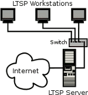
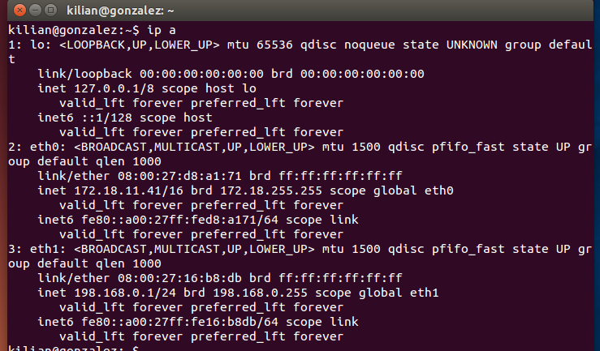
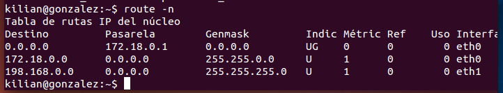
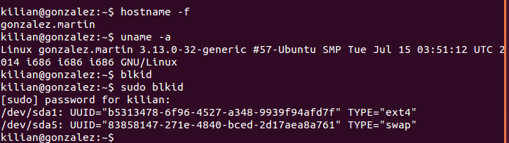
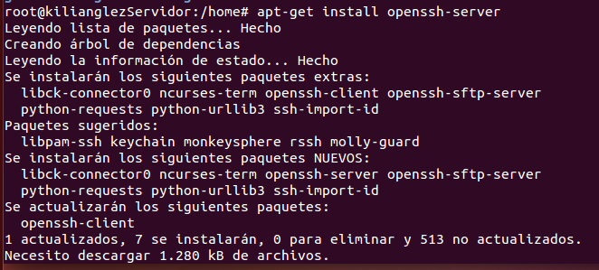
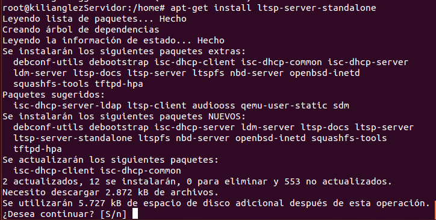
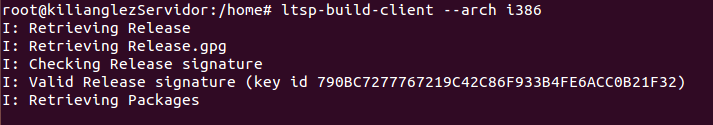
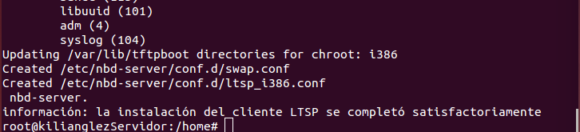
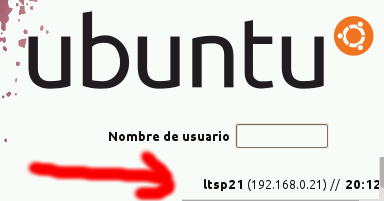

# 1. Clientes ligeros con LTSP
Este sistema te permite configurar un servidor para que de soporte a terminales “tontos”. Me explico:

LTSP es un proyecto bajo linux que a grandes rasgos, te permite que clientes ligeros (ordenadores con carencias, ya sea falta de hdd, poca ram, cpu's antiguas y desfasadas, etc) arranquen via PXE (arranque por ethernet) como si fueran máquinas autónomas.
Al configurar un servidor LTSP, este da servicio a los clientes ligeros (ofrece recursos).
Cuando un cliente ligero arranca, el servidor le suministra el sistema operativo, en este caso cualquier distribución de Linux. Por eso, se puede arrancar un cliente ligero sin que disponga de hdd.
El proceso no lo voy a detallar, en www.ltsp.org teneis toda la info. Pero deciros que básicamente funciona así:

-el servidor LTSP asigna una ip al cliente via DHCP
-realizada la conexión, via TFTP, el servidor envia al cliente la imagen del sistema.
-cuando el cliente ha cargado la imagen, te pide loguearse, y listo.

# 2. Preparativos
Realizar las siguientes tareas:
* Trabajaremos de forma individual.
* Usaremos 2 MVs para montar clientes ligeros con LTSP.


Veamos el esquema:



# 3. Servidor LTSP
## 3.1 Preparar la MV Server
La MV del servidor necesitará dos interfaces de red, una interfaz externa:
* para comunicarse con Internet.
* Configurarla en VBox como adaptador puente.
* IP estática 172.18.11.41
y una interfaz interna
* para conectarse con los clientes ligeros.
* La IP de esta interfaz de red debe ser estática y debe estar en la misma red que los clientes (IP 192.168.0.1).
* Configurarla en VBox como "red interna".

## 3.2 Instalación del SSOO
* Instalar un SO GNU/Linux en la MV.
* Nombre de usuario: nombre-del-alumno, en minúsculas, sin tildes ni eñes. 
* Clave de root, poner como clave el DNI con la letra en minúsculas.
* Poner como nombre de equipo el primer apellido del alumno en minúsculas y sin tildes.
* Poner como nombre de dominio el segundo apellido del alumno en minúsculas y sin tildes.
* Incluir en el informe la salida de los comandos siguientes: 
```
ip a
route -n
hostname -a
hostname -f
uname -a
blkid
```





* Crear 3 usuarios locales llamados: primer-del-apellido-alumno1, primer-del-apellido-alumno2,
primer-del-apellido-alumno3.

## 3.3 Instalar el servicio LTSP
* Instalar el servidor SSH `apt-get install openssh-server`.

* Instalar servidor de clientes ligeros, según la documentación para el SO elegido. 
En el caso de Debian/Ubuntu puede ser `apt-get install ltsp-server-standalone`.

* Ahora vamos a crear un imagen del SO a partir del sistema real haciendo `ltsp-build-client`.
La imagen del SO se cargará en la memoria de los clientes ligeros.

> **32 bits o 64 bits**
> 
> Si el servidor es de 64-bits pero los clientes tienen arquitectura de 32-bits 
entonces usar el comando siguiente `ltsp-build-client --arch i386` para crear una imagen
de 32 bits.
>


* Ejecutar `ltsp-info`, para consultar información.
 
> **Comandos LTSP: Para volver a actualizar la imagen**
>
> * `ltsp-update-kernel`
> * `ltsp-update-sshkeys`
> * `ltsp-update-image`


# 4. Preparar MV Cliente
Crear la MV cliente en VirtualBox:
* Sin disco duro y sin unidad de DVD.
* Sólo tiene RAM, flopy
* Tarjeta de red PXE en modo "red interna".

Con el servidor encendido, iniciar la MV cliente desde PXE:
* Comprobar que todo funciona correctamente.
* Si la tarjeta de red no inicia correctamente el protocolo PXE, 
conectar disquete Etherboot en la disquetera, tal y como se indica en la documentación de la web de LTSP.

En la imagen podemos ver un ejemplo de la ventana de login de un cliente ligero. 
Vemos como aparece la IP que proporciona el servidor DHCP del servidor LTSP al cliente.



Cuando el cliente se conecte
* entramos con los usuarios apellido-del-alumno[1-3]
* Ir al servidor, como superusuario y capturar la salida de los siguientes comandos:
```
arp
whoami
who
```
* Reiniciar la MV cliente y grabar vídeo mostrando el funcionamiento.


