#1 Samba - OpenSUSE


* Vamos a necesitar las siguientes 3 MVs:
    1. Un servidor GNU/Linux con IP estática (172.18.11.33).
    1. Un cliente GNU/Linux con IP estática (172.18.11.34).
    1. Un cliente Windows con IP estática (172.18.11.13).

##1.1 Preparativos
* Configurar el servidor GNU/Linux con siguientes valores:
    * Nombre de usuario: kilian
    * Clave del usuario root: 43833998t
    * Nombre de equipo: samba-server
    * Nombre de dominio: gonzalez
    * Comprobar que tenemos instalado openssh-server.
* Añadir en /etc/hosts los equipos samba-cli1 y samba-cli2-11 

Capturar salida de los comandos siguientes en el servidor:
```
hostname -f
ip a
lsblk
sudo blkid
```
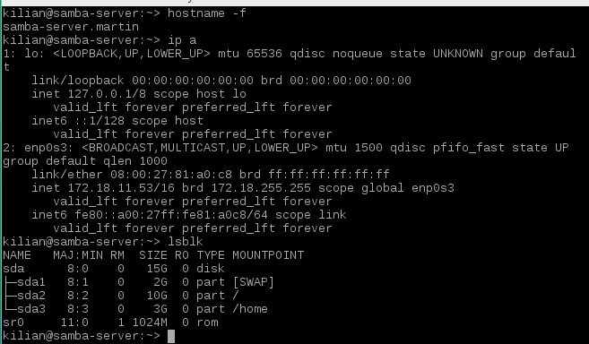
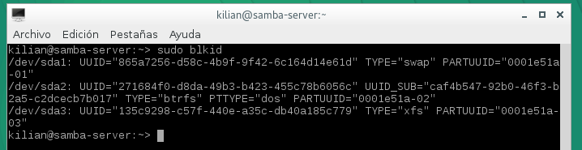

##1.2 Usuarios locales
Capturar imágenes del resultado final.

Vamos a GNU/Linux, y creamos los siguientes grupos y usuarios. Podemos usar comandos o entorno gráfico Yast:
* Grupo `jedis` con `jedi1`, `jedi2` y `supersamba`.
* Grupo `siths` con `sith1` y `sith2` y `supersamba`.
* Crear el usuario `smbguest`. Para asegurarnos que nadie puede usar `smbguest` para 
entrar en nuestra máquina mediante login, vamos a modificar en el fichero `/etc/passwd` de la 
siguiente manera: "smbguest: x :1001:1001:,,,:/home/smbguest:**/bin/false**".
* Crear el grupo `starwars`, y dentro de este poner a todos los `siths`, `jedis`, `supersamba` y a `smbguest`.

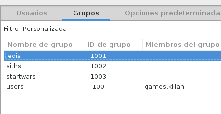
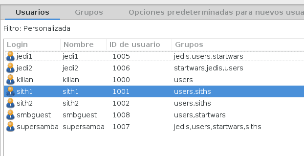
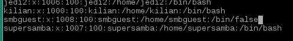
##1.3 Instalar Samba
Samba viene ya instalado en opensuse, accedemos por yast y ahí lo configuramos.


##1.4 Crear las carpetas para los recursos compartidos
Capturar imagen del resultado final.

* Vamos a crear las carpetas de los recursos compartidos con los permisos siguientes:
    * `/var/samba/public.d`
        * Usuario propietario `supersamba`.
        * Grupo propietario `starwars`. 
        * Poner permisos 775.
    * `/var/samba/corusant.d`
        * Usuario propietario `supersamba`.
        * Grupo propietario `siths`. 
        * Poner permisos 770.
    * `/var/samba/tatooine.d`
        * Usuario propietario `supersamba`.
        * Grupo propietario `jedis`. 
        * Poner permisos 770.

> * `public`, será un recurso compartido accesible para todos los usuarios en modo lectura.
> * `cdrom`, es el recurso dispositivo cdrom de la máquina donde está instalado el servidor samba.

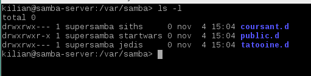

##1.5 Configurar Samba
Capturar imágenes del proceso.

* Vamos a hacer una copia de seguridad del fichero de configuración existente 
`cp /etc/samba/smb.conf /etc/samba/smb.conf.000`.
* Vamos a configurar el servidor Samba con las siguientes opciones. Podemos usar Yast o 
modificar directamente el fichero de configuración:


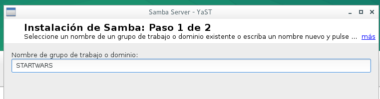
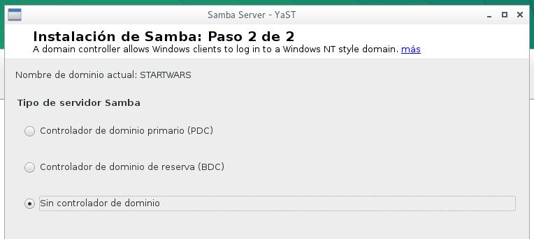


```
[global]
netbios name = GONZALEZ-11
workgroup = STARWARS
server string = Servidor Samba del PC 11
security = user
map to guest = bad user
guest account = smbguest

[cdrom]
path = /dev/cdrom
guest ok = yes
read only = yes

[public]
path = /var/samba/public.d
guest ok = yes
read only = yes

[corusant]
path = /var/samba/corusant.d
read only = no
valid users = @siths

[tatooine]
path = /var/samba/tatooine.d
read only = no
valid users = jedi1, jedi2
```


* Comprobar resultado `cat /etc/samba/smb.conf`.

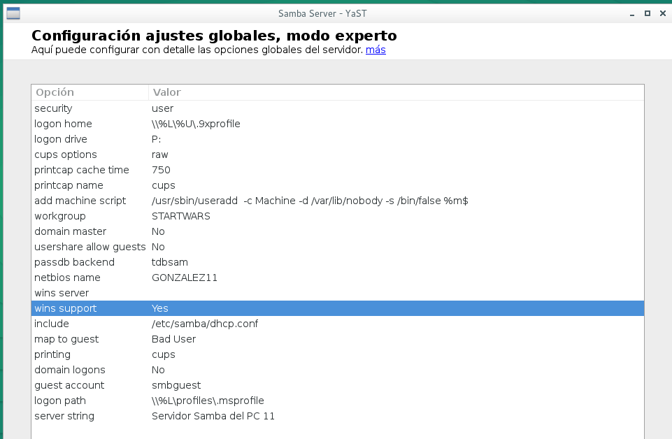
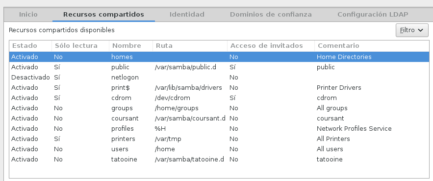
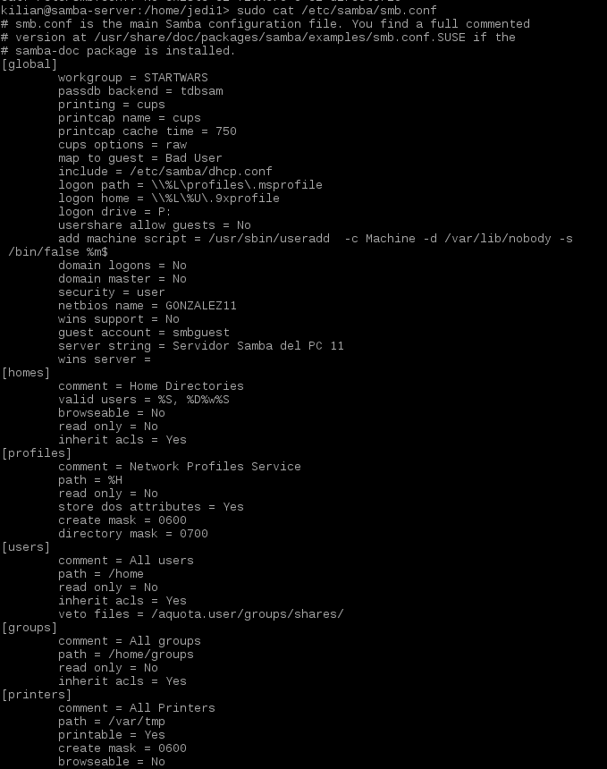
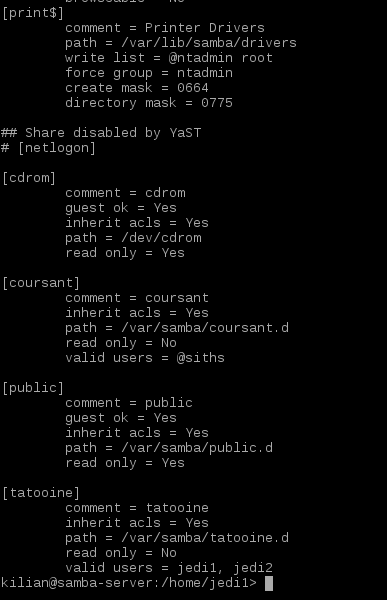


* Comprobar que todo está ok con `testparm`.

##1.6 Usuarios Samba
Después de crear los usuarios en el sistema, hay que añadirlos a Samba.
* Para eso hay que usar el comando siguiente para cada usuario de Samba: `smbpasswd -a nombreusuario`

Capturar imagen del comando siguiente.
* Al terminar comprobamos nuestra lista de usuarios Samba con el comando: `pdbedit -L`

* 


##1.7 Reiniciar
* Ahora que hemos terminado con el servidor, hay que reiniciar el servicio 
para que se lean los cambios de configuración (Consultar los apuntes): 
* `systemctl stop smb`, `systemctl start smb`, `systemctl status smb`
* 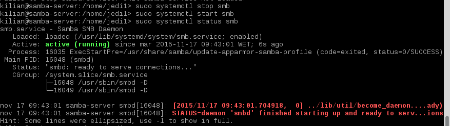
* `systemctl stop nmb`, `systemctl start nmb`, `systemctl status nmb`
* 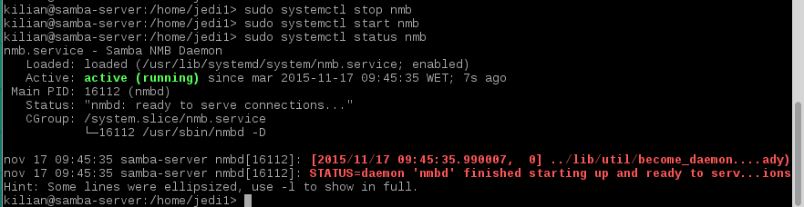
Capturar imagen de los comandos siguientes.
* Comprobar
```
    sudo testparm (Verifica la sintaxis del fichero de configuración del servidor Samba)
``` 
* 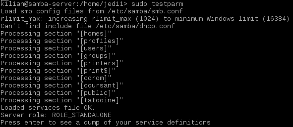

```
    sudo netstat -tap (Vemos que el servicio SMB/CIF está a la escucha)
```
* 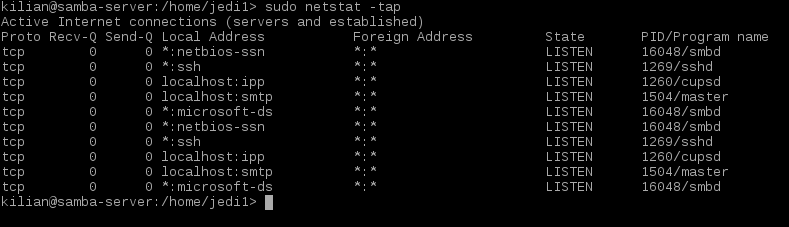
#2. Windows
##2.1 Cliente Windows GUI

Desde un cliente Windows trataremos de acceder a los recursos compartidos del servidor Samba.


* Comprobar los accesos de todas las formas posibles. Como si fuéramos un `sith`, un `jedi` y/o un invitado.

* 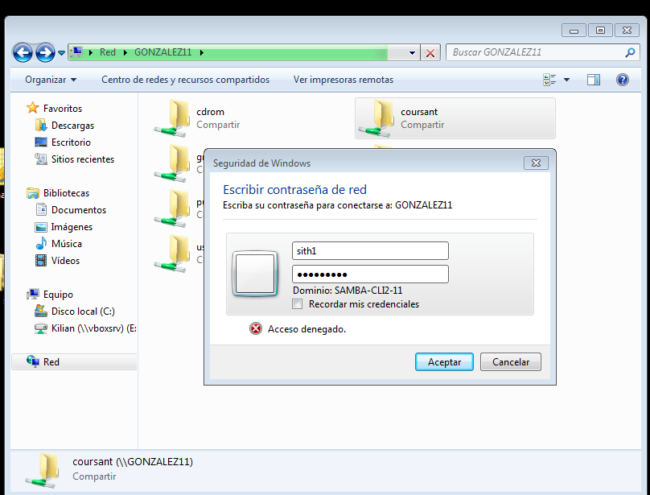
* 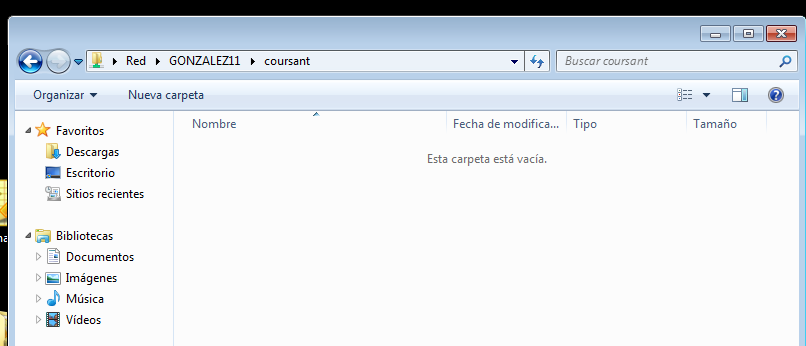
* 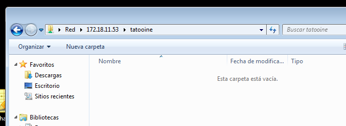

> * Después de cada conexión se quedan guardada la información en el cliente Windows (Ver comando `net use`).
* 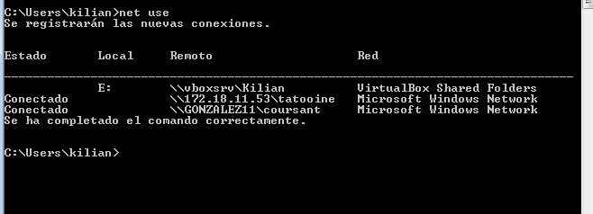
> * Para cerrar las conexión SMB/CIFS que ha realizado el cliente al servidor, usamos el comando: `C:>net use * /d /y`.
* 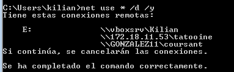

Capturar imagen de los comandos siguientes:
* Para comprobar resultados, desde el servidor Samba ejecutamos: `smbstatus`, `netstat -ntap`
* * 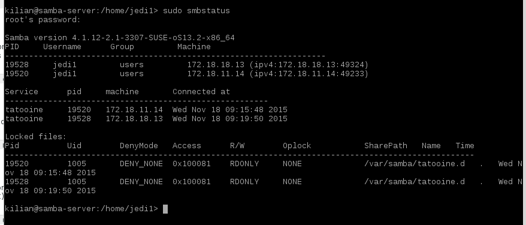
* * 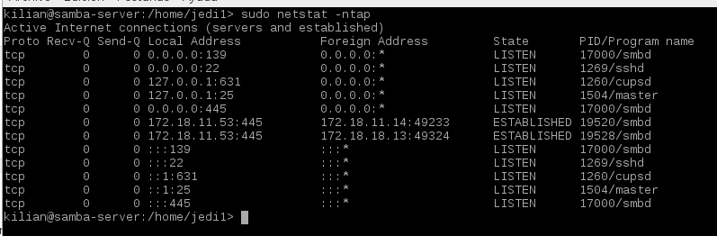

##2.2 Cliente Windows comandos

* En el cliente Windows, para consultar todas las conexiones/recursos conectados hacemos `C:>net use`.
* Si hubiera alguna conexión abierta, para cerrar las conexión SMB al servidor, 
podemos usar el siguiente comando `C:>net use * /d /y`. Si ahora ejecutamos el comando `net use`, 
debemos comprobar que NO hay conexiones establecidas.

Capturar imagen de los comandos siguientes:
* Abrir una shell de windows. Usar el comando `net use /?`, para consultar la ayuda del comando.
* 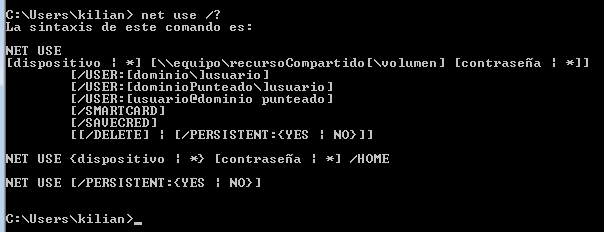

* Con el comando `net view`, vemos las máquinas (con recursos CIFS) accesibles por la red.
* 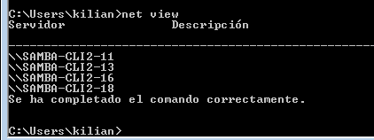
* Vamos a conectarnos desde la máquina Windows al servidor Samba usando los comandos net. 
* 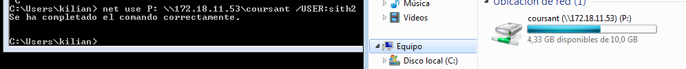


Capturar imagen de los comandos siguientes:
* Para comprobar resultados, desde el servidor Samba ejecutamos: `smbstatus`, `netstat -ntap`
* 

#3 Cliente GNU/Linux
##3.1 Cliente GNU/Linux GUI
Desde en entorno gráfico, podemos comprobar el acceso a recursos compartidos SMB/CIFS. 


Ejemplo accediendo al recurso prueba del servidor Samba, 
pulsamos CTRL+L y escribimos `smb://ip-del-servidor-samba`:
* 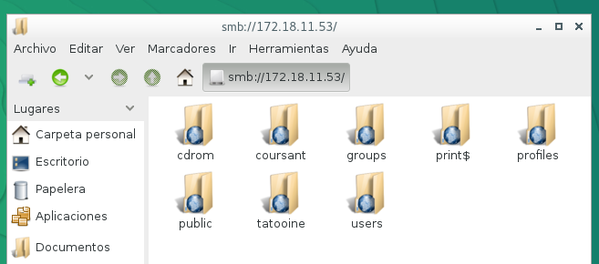

Capturar imagen de lo siguiente:
* Probar a crear carpetas/archivos en `corusant` y en  `tatooine`. 
* 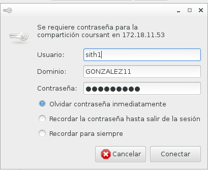
* 
* 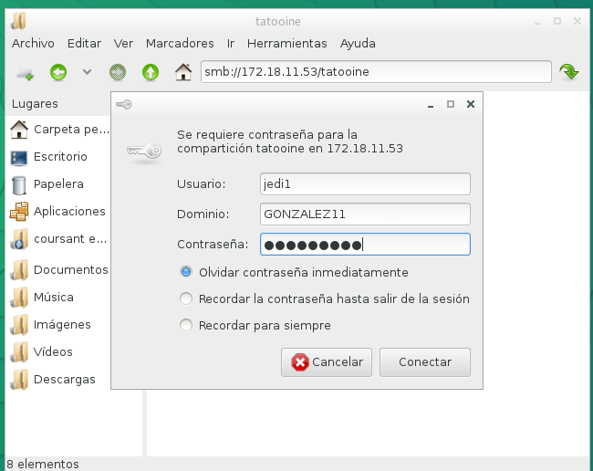
* 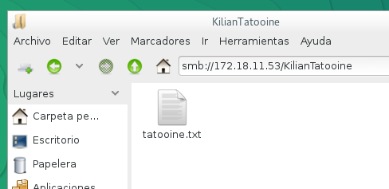

En el momento de autenticarse para acceder al recurso remoto, poner 
en **Dominio** el *nombre-netbios-del-servidor-samba*.
* Comprobar que el recurso `public` es de sólo lectura.
* 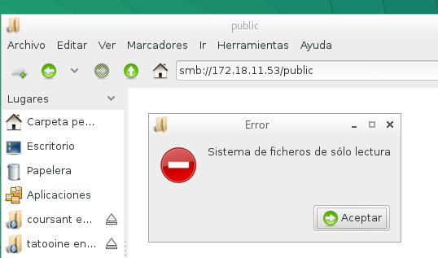
* Para comprobar resultados, desde el servidor Samba ejecutamos: `smbstatus`, `netstat -ntap`
* 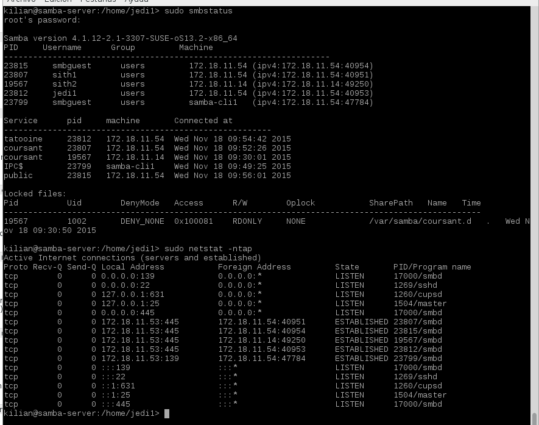

##3.2 Cliente GNU/Linux comandos
Capturar imagenes de todo el proceso.


* Vamos a un equipo GNU/Linux que será nuestro cliente Samba. Desde este 
equipo usaremos comandos para acceder a la carpeta compartida.
* Primero comprobar el uso de las siguientes herramientas:
```
sudo smbtree                         (Muestra todos los equipos/recursos de la red SMB/CIFS)
smbclient --list ip-servidor-samba   (Muestra los recursos SMB/CIFS de un equipo concreto)
```
* 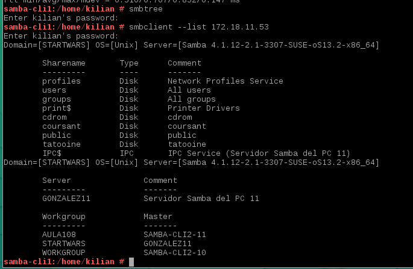

* Ahora crearemos en local la carpeta `/mnt/samba-remoto/corusant`.
* MONTAJE: Con el usuario root, usamos el siguiente comando para montar un recurso 
compartido de Samba Server, como si fuera una carpeta más de nuestro sistema:
`mount -t cifs //172.18.XX.55/corusant /mnt/samba-remoto/corusant -o username=sith1`

* 

* COMPROBAR: Ejecutar el comando `df -hT`. Veremos que el recurso ha sido montado.

* 

> * Si montamos la carpeta de `corusat`, lo que escribamos en `/mnt/samba-remoto/corusant` 
debe aparecer en la máquina del servidor Samba. ¡Comprobarlo!
* 
> * Para desmontar el recurso remoto usamos el comando `umount`.

* Para comprobar resultados, desde el servidor Samba ejecutamos: `smbstatus` y `netstat -ntap`.
* 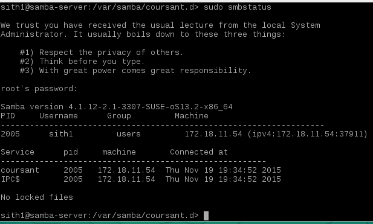
* * 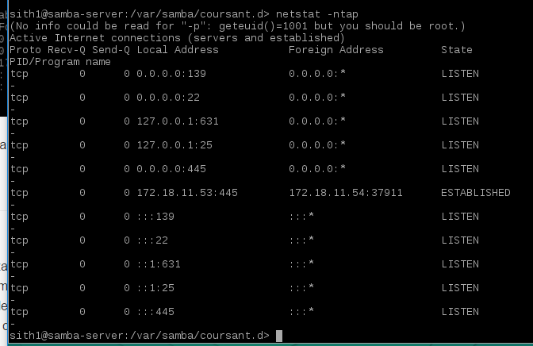
##3.3 Montaje automático
Capturar imágenes del proceso.


Si reiniciamos el equipo cliente, podremos ver que los montajes realizados de forma manual ya no están (`df -hT`).
Si queremos volver a acceder a los recursos remotos debemos repetir el proceso de  montaje manual, 
a no ser que hagamos una configuración de  montaje permanente o automática.

* Para configurar acciones de montaje automáticos cada vez que se inicie el equipo, 
debemos configurar el fichero `/etc/fstab`. Veamos un ejemplo:
* 


* Reiniciar el equipo y comprobar que se realiza el montaje automático al inicio.
* 
* 

#3. Preguntas para resolver

* ¿Las claves de los usuarios en GNU/Linux deben ser las mismas que las que usa Samba?
No, pueden ser distintas pero para acordarnos es más fácil que sean iguales
* ¿Puedo definir un usuario en Samba llamado sith3, y que no exista como usuario del sistema?
No, debe existir primero en el sistema.
* ¿Cómo podemos hacer que los usuarios sith1 y sith2 no puedan acceder al sistema pero sí al samba? 
(Consultar `/etc/passwd`)
en el fichero "/etc/passwd" añadimos la siguiente linea:

sith1: x :1001:1001:,,,:/home/sith1:/bin/false
sith2: x :1002:1002:,,,:/home/sith2:/bin/false

Así se le deniega el acceso al sistema pero en samba al ya estar creados si pueden acceder a recursos compartidos.

* Añadir el recurso `[homes]` al fichero `smb.conf` según los apuntes. ¿Qué efecto tiene?

Observe que el recurso compartido [homes] no tiene una directriz force user o force group como si lo tiene el recurso [public]. El recurso compartido [homes] utiliza los detalles del usuario autenticado para cualquier archivo al contrario de force user y force group en [public].
