<center>***Kilian Manuel González Martín - 2º ASIR***</center> 


#Tareas programadas

#1. SO OpenSUSE

##1.1 Configuración de la máquina

Configurar el equipo GNU/Linux OpenSUSE 13.2 con:
* IP: 172.18.11.51 
* Máscara de red: 255.255.0.0
* Gateway: 172.18.0.1
* Servidor DNS: 8.8.4.4
* Nombre de equipo: gonzalez3
* Nombre de dominio: martin


Además también:
* Instalar openssh-server para que el profesor pueda acceder de forma remota.
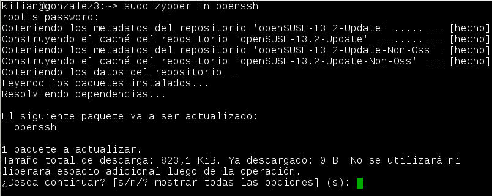

Capturar imágen de la configuración del equipo:

    uname -a
    hostname -a
    hostname -d
    ip a
    route -n
    blkid
    
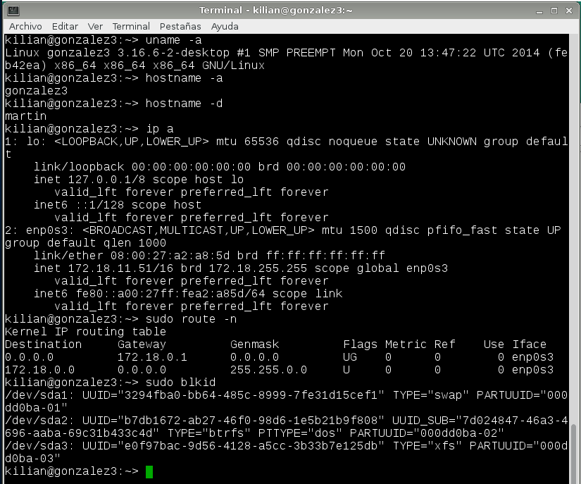

##1.2 Tarea diferida

* Vamos a programar una tarea diferida (comando `at`) para apagar el equipo.
* Compruebo que at está en funcionamiento
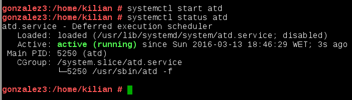
* El comando para apagar el sistema es `shutdown`.

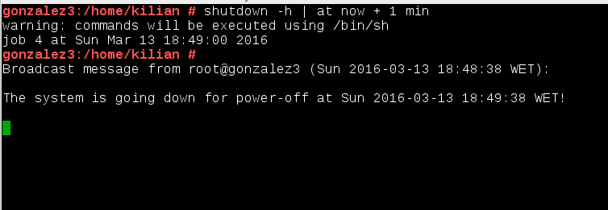

> * Si el usuario no tuviera permisos para ejecutar at, consultar los ficheros:
>     * `/etc/at.deny`
>     * `/etc/at.allow`

##1.3 Tarea periódica

* Antes de usar cron comprobamos que está instalado.
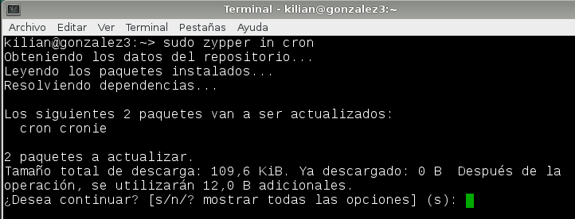
* Programar una tarea periódica (crontab) que nos mostrará un mensaje en pantalla.
* Para programar una tarea periódica tenemos estas formas:
    * Los usuarios usan el comando `crontab`  para programar sus tareas.
    * El usuario root usa el fichero `/etc/crontab` para programar las tareas del sistema. 
* Ejemplo de script que muestra un mensaje de aviso:

```
    #!/bin/sh
    # Mostrar mensaje en pantalla
    DISPLAY=:0
    export DISPLAY
    zenity --info --text="¡Que la fuerza te acompañe!"
```
* Instalo el zenity
 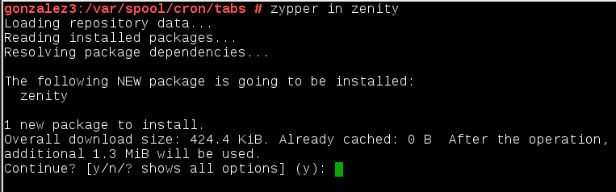
* Para la ejecución de la tarea cada minuto introducimos en /var/spool/cron/tabs/aitor los parámetos para que sea interpretado y la ruta donde está ubicado el script.
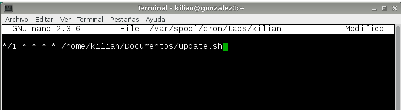

* Comprobación del contenido del script y la tarea en funcionamiento.
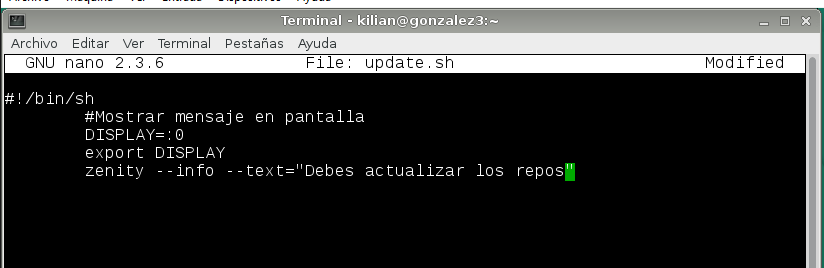

> * NOTA: para poder llevar a cabo esta tarea hay que instalar zenity previamente.

##1.4 Tarea asíncrona

* Vamos a programar una tarea asíncrona para realizar una copia de backup.
* Podemos usar el comando `tar` dentro de un script para realizar la 
  copia de los ficheros del usuario en una zona de backup.
    * Directorio de datos `/home/nombre-alumno1`.
    * Directorio para guardar el backup `/var/backup-XX/nombre-alumno1`.
   

* Primero que nada, comprobamos el contenido del script y lo ejecutamos.
![] 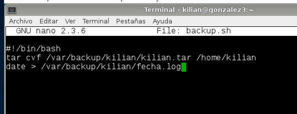
 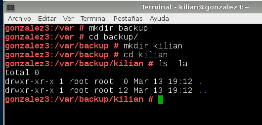
 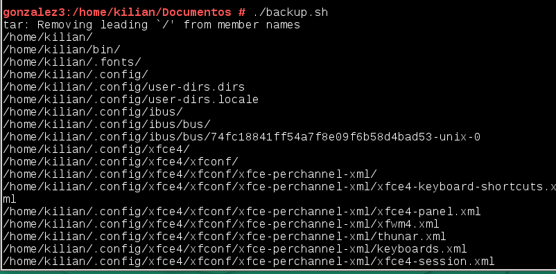

* Seguidamente nos vamos al directorio donde guardaremos el backup y observamos que ha funcionado.
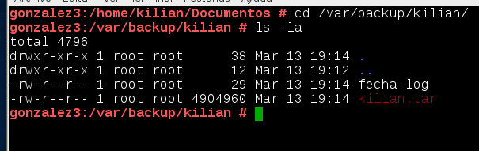

> Para definir una tarea asíncrona ponemos el script de ejecución en alguno 
de los directorios siguientes:
> * /etc/cron.hourly

> * /etc/cron.daily
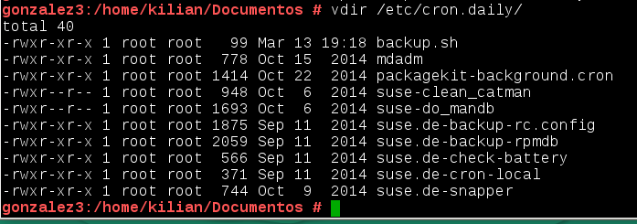
> * /etc/cron.weekly
> * /etc/cron.monthly


#2. Windows7

##2.1 Configuración de la máquina

Configurar máquina *Windows 7 Professional* con:
* IP: 172.18.11.11 


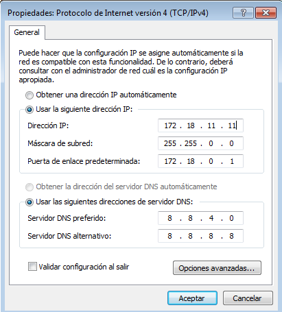


##2.2 Tarea diferida

* Vamos a programar una tarea diferida para que nos muestre un mensaje 
de ánimo en pantalla.
* En Windows 7 para abrir el programador de tareas hacemos 
`Panel de control -> Herramientas administrativas -> Programador de tareas`.

* Creamos la tarea básica de tipo mostrar un mensaje.
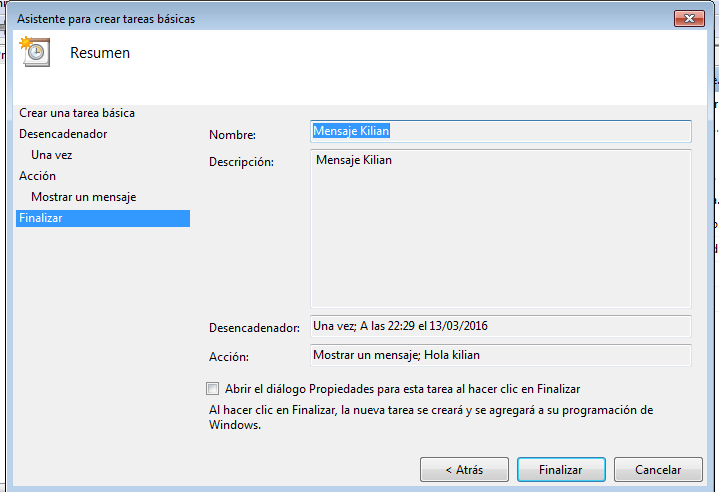
* Comprobación de la realización de la tarea:
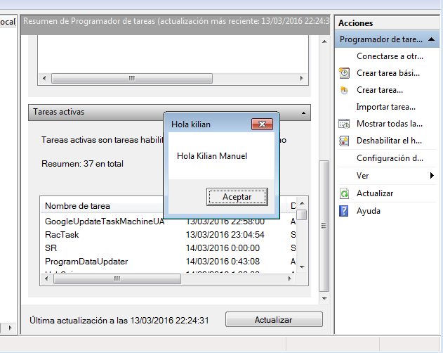

##2.3 Tarea periódica

* Vamos a programar una tarea periódica para apagar el equipo.
* El comando para apagar el sistema es `shutdown`.

> * `shutdown /?`: Muestra la ayuda del comando.
> * `shutdown /s`: Programar un apagado.

* Creamos la tarea básica de tipo iniciar un programa.
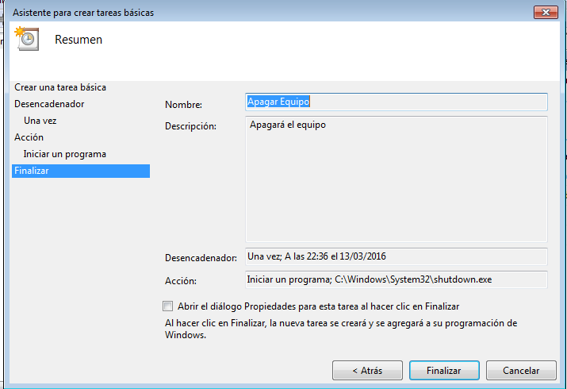
* Comprobación de la realización de la tarea:
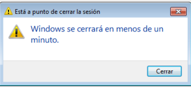

##2.4 Tarea asíncrona

* Vamos a programar una tarea asíncrona para realizar una copia de backup.
* Como ejemplo podemos crear un fichero `backup.bat` con comandos del tipo `xcopy`,
para copiar los documentos del usuario en una zona de backup.
    * Directorio de datos `c:\Users\nombre-alumno1\`.
    * Directorio para guardar el backup `c:\backup-XX\nombre-alumno1`.
    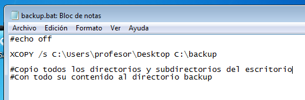
    


* Comprobación de la realización de la tarea:
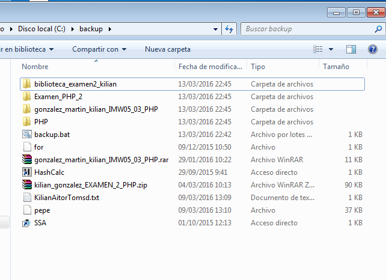
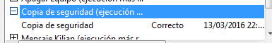

