#2. Primeros pasos

##2.1 Instalar

> Para instalar vagrant hay varias formas (como todos sabemos).

* Nosotros vamos a usar el paquete [Vagrant-deb](http://172.20.1.2/~david/vagrant_1.7.2_x86_64.deb) 
preparado para descargar del servidor Leela.

##2.2. Proyecto
* Crear un directorio para nuestro proyecto vagrant.
```
    mkdir mivagrant11
    cd mivagrant11
    vagrant init
```


##2.3 Imagen, caja o box
* Ahora necesitamos obtener una imagen(caja, box) de un sistema operativo. Por ejemplo:
```
vagrant box add micaja11_ubuntu_precise32 http://files.vagrantup.com/precise32.box
```


* Podemos listar las cajas/imágenes disponibles actualmente en nuestro sistema con `vagrant box list`.
* Para usar una caja determinada en nuestro proyecto, modificamos el fichero `Vagrantfile` 
de la carpeta del proyecto.
* Cambiamos la línea `config.vm.box = "base"` por  `config.vm.box = "micaja11_ubuntu_precise32"`.


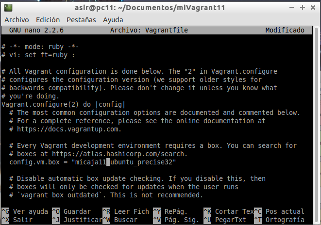

##2.4 Iniciar la máquina

Vamos a iniciar la máquina virtual creada con Vagrant:
* `cd mivagrant11`
* `vagrant up`: comando para iniciar una la instancia de la máquina.

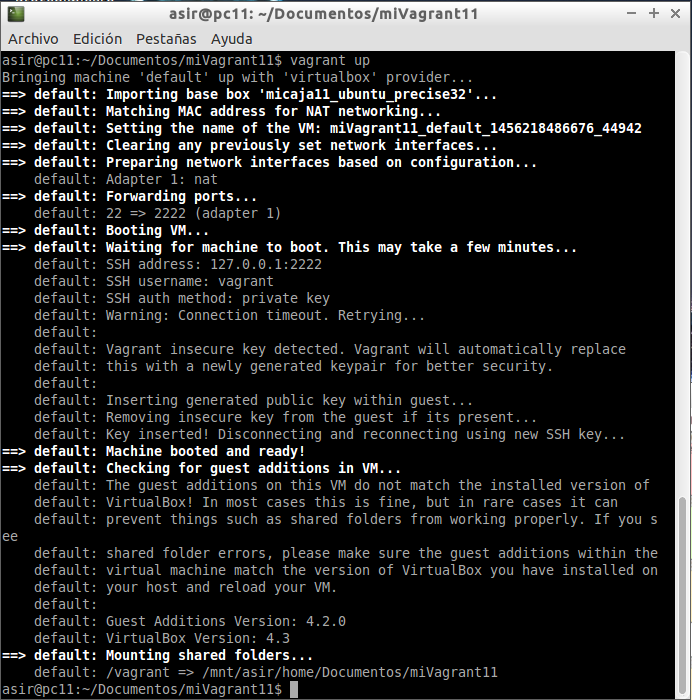

* Podemos usar ssh para conectar con nuestra máquina virtual (`vagrant ssh`).
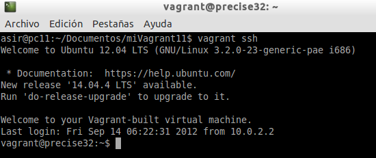
* Otros comandos de Vagrant:
    * `vagrant suspend`: Suspender la máquina.
    * `vagrant resume` : Volver a despertar la máquina.
    * `vagrant halt`: Apagarla la máquina.
    * `vagrant status`: Estado actual de la máquina.
    * `vagrant destroy`: Para eliminar completamente la máquina.

> Debemos tener en cuenta que tener el ambiente en modo **suspendido** consume espacio
 en disco debido a que el estado de la maquina virtual que suele almacenarse en RAM debe pasar a disco.

#3. Configuración

##3.1 Carpetas sincronizadas

> La carpeta del proyecto que contiene el `Vagrantfile` comparte los 
archivos entre el sistema anfitrión y el virtualizado, esto nos permite 
compartir archivos fácilmente entre los ambientes.

* Para identificar la carpeta compartida dentro del ambiente virtual,
lo que hacemos es:
```
    vagrant up
    vagrant ssh
    ls /vagrant
```

> Esto nos mostrará que efectivamente el directorio `/vagrant` dentro del ambiente 
virtual posee el mismo `Vagrantfile` que se encuentra en nuestro sistema anfitrión. 
>
> Cualquier archivo que coloquemos en este directorio será accesible desde cualquiera de los 2 extremos. 

##3.2 Redireccionamiento de los puertos

Uno de los casos más comunes cuando tenemos una máquina virtual es la 
situación que estamos trabajando con proyectos enfocados a la web, 
y para acceder a las páginas no es lo más cómodo tener que meternos 
por terminal al ambiente virtual y llamarlas desde ahí, aquí entra en 
juego el enrutamiento de puertos.

* Modificar el fichero `Vagrantfile`, de modo que el puerto 4567 del 
sistema anfitrión será enrutado al puerto 80 del ambiente virtualizado.

`config.vm.network :forwarded_port, host: 4567, guest: 80`

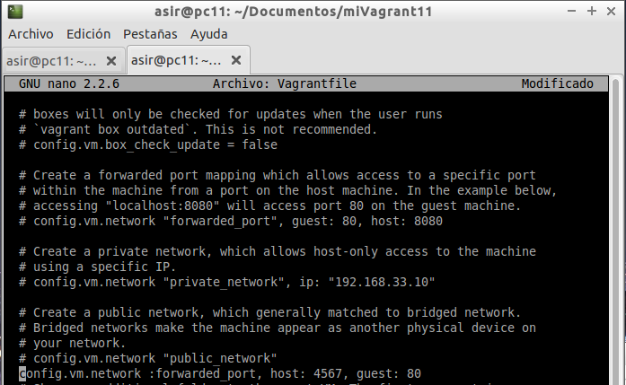

* Luego iniciamos la MV (si ya se encuentra en ejecución lo podemos refrescar 
con `vagrant reload`)
* En nuestro sistema anfitrión nos dirigimos al explorador de internet,
 y colocamos: `http://127.0.0.1:4567`. En realidad estaremos accediendo 
 al puerto 80 de nuestro sistema virtualizado. 
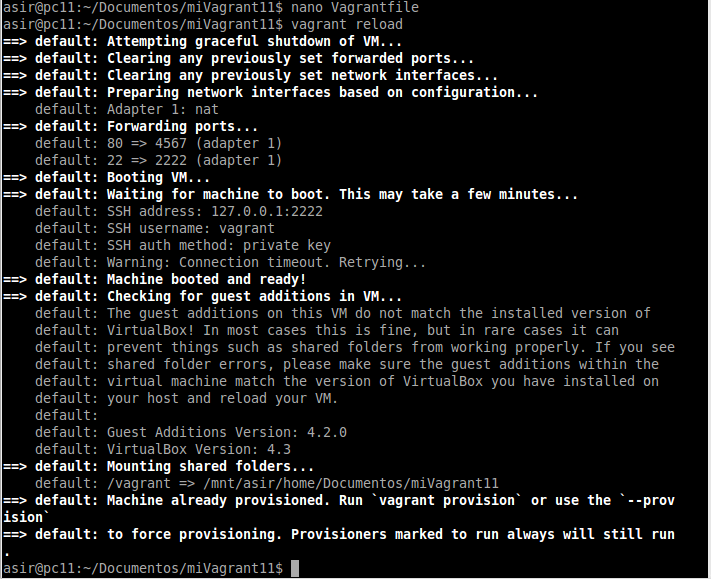
##3.3 Otras configuraciones

A continuación se muestran ejemplos que NO hay que hacer. Sólo es información.

Enlace de interés: 
* [Tutorial Vagrant. ¿Qué es y cómo usarlo?](https://geekytheory.com/tutorial-vagrant-1-que-es-y-como-usarlo)

Ejemplo para configurar la red:
```
  config.vm.network "private_network", ip: "192.168.33.10"
```

Ejemplo para configurar las carpetas compartidas:
```
  config.vm.synced_folder "htdocs", "/var/www/html"
```

Ejemplo, configurar en Vagrantfile la conexión SSH de vagrant a nuestra máquina:
```
  config.ssh.username = 'root'
  config.ssh.password = 'vagrant'
  config.ssh.insert_key = 'true'
```

Ejemplo para configurar en Vagrantfile la ejecución remota de aplicaciones
gráficas instaladas en la máquina virtual, mediante SSH:
```
  config.ssh.forward_agent = true
  config.ssh.forward_x11 = true
```

#4.Suministro

##4.1 Suministro mediante script

Quizás el aspecto con mayor beneficios del enfoque que usa Vagrant 
es el uso de herramientas de suministro, el cual consiste en correr 
una receta o una serie de scripts durante el proceso de levantamiento 
del ambiente virtual que permite instalar y configurar un sin fin 
piezas de software, esto con el fin de que el ambiente previamente 
configurado y con todas las herramientas necesarias una vez haya sido levantado.

Por ahora suministremos al ambiente virtual con un pequeño script que 
instale Apache.

* Crear el script `install_apache.sh`, dentro del proyecto con el siguiente
contenido:

```
    #!/usr/bin/env bash

    apt-get update
    apt-get install -y apache2
    rm -rf /var/www
    ln -fs /vagrant /var/www
    echo "<h1>Actividad de Vagrant</h1>" > /var/www/index.html
    echo "<p>Curso201516</p>" >> /var/www/index.html
    echo "<p>Kilian</p>" >> /var/www/index.html
```
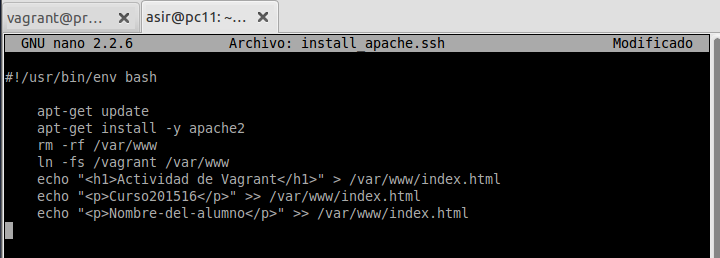
* Modificar Vagrantfile y agregar la siguiente línea a la configuración:
`config.vm.provision :shell, :path => "install_apache.sh"`


> * Esta instrucción le indica a Vagrant que debe usar la herramienta nativa shell 
para suministrar el ambiente virtual con el archivo `install_apache.sh`.
> * Si usamos los siguiente `config.vm.provision "shell", inline: '"echo "Hola"'`, ejecuta
directamente el comando especificado, sin usar script.

* Iniciamos la MV o `vagrant reload` si está en ejecución para que coja el cambio de la configuración.

> Podremos notar, al iniciar la máquina, que en los mensajes de salida se muestran
mensajes que indican cómo se va instalando el paquete de Apache que indicamos:

* Para verificar que efectivamente el servidor Apache ha sido instalado e iniciado, 
abrimos navegador en la máquina real con URL `http://127.0.0.1:4567`.
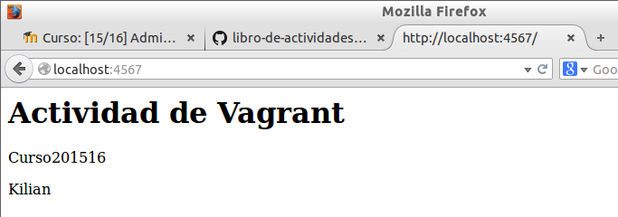
##4.2 Suministro mediante Puppet

Enlace de interés:
* [Crear un entorno de desarrollo con vagrant y puppet](http://developerlover.com/crear-un-entorno-de-desarrollo-con-vagrant-y-puppet/)
* friendsofvagrant.github.io -> Puppet Provisioning

Veamos imágenes de ejemplo suministradas por Aarón Gonźalez Díaz:

Vagrantfile configurado con puppet:

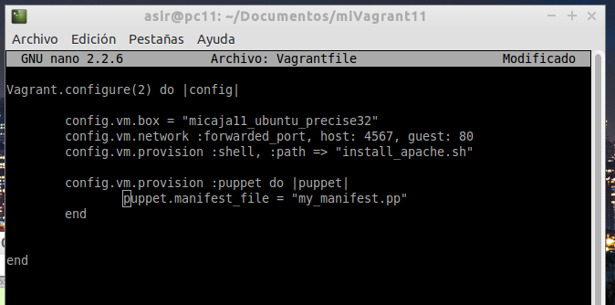

Fichero de configuración de puppet:


> Veamos otros ejemplo:
> ```
> Vagrant::Config.run do |config|
>   config.vm.provision :puppet do |puppet|
>     puppet.manifest_path = "manifests"
>     puppet.manifest_file = "apache2.pp"
>   end
> end
>```

Aquí comprobamos que se instaló el comando tree
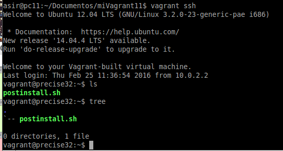

#5. Otras cajas, nuestras cajas

Existen muchos repositorios para descargar cajas. Por ejemplo:
* [Vagrant Box List](http://www.vagrantbox.es)
* [HashiCorp's Atlas box catalog](https://atlas.hashicorp.com/boxes/search)

> Incluso podemos descargarnos cajas con Windows, GNU/Linux con entorno gráfico, BSD, etc.

Si estamos pensando en crear nuestra propia caja, entonces podemos seguir las
indicaciones del siguiente enlace:
* [¿Cómo crear una Base Box en Vagrant a partir de una máquina virtual](http://www.dbigcloud.com/virtualizacion/146-como-crear-un-vase-box-en-vagrant-a-partir-de-una-maquina-virtual.html)

Como recomendación vamos a crear una nueva carpeta para este nuevo proyecto vagrant. Ejecutamos
`vagrant init` para crear el fichero de configuración nuevo.

A partir de una máquina virtual VirtualBox (`v1-opensuse132-xfce`) vamos a crear la caja `package.box`.


Comprobamos que se ha creado la caja `package.box` en el directorio donde
hemos ejecutado el comando.
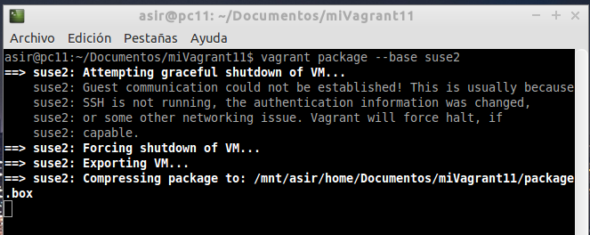


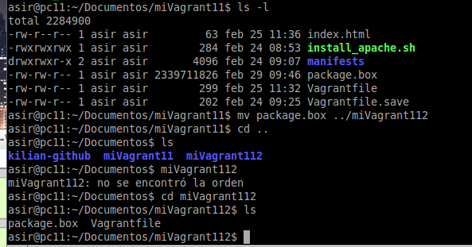
Añado la caja

Edito el VagrantFile para selecionar mi maquina OpenSuse Llamada suse2
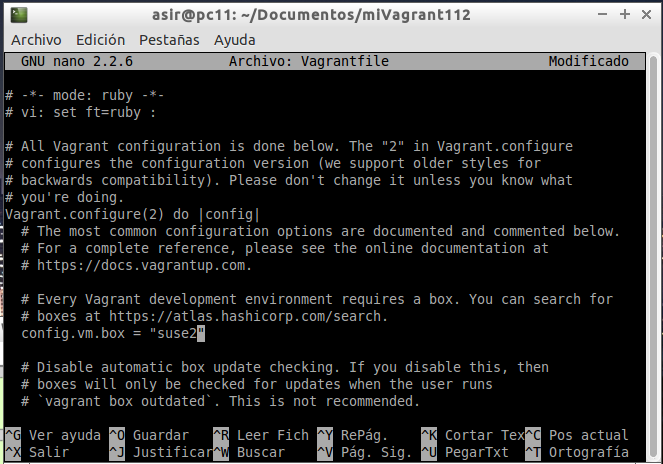
Y la levanto con vegrant up
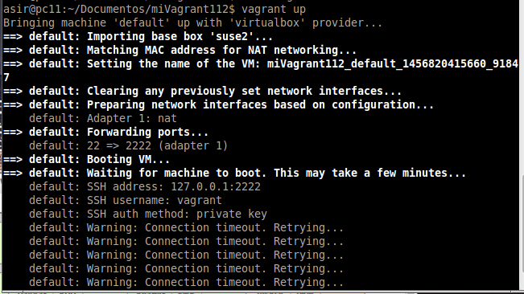


Al levantar la máquina con esta nueva caja obtengo este error.
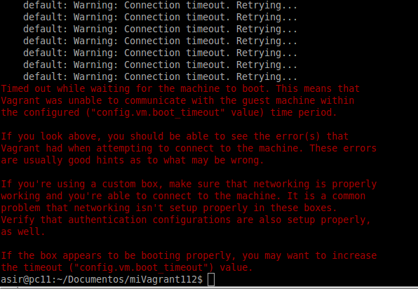


